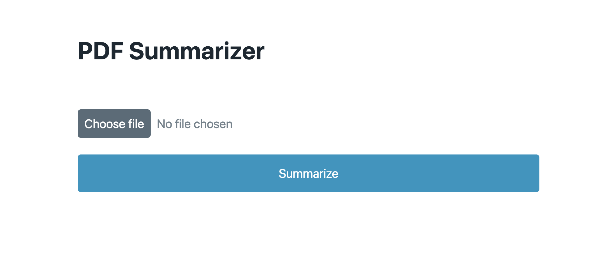

# sveltekit-langchain-boilerplate



Welcome to the [SvelteKit](https://github.com/sveltejs/kit) & [Langchain]((https://github.com/hwchase17/langchainjs)) Boilerplate repository! This project provides a solid starting point for building powerful, AI-driven applications using SvelteKit for the frontend and LangChain to integrate large language models (LLMs).

## Overview
This boilerplate combines the simplicity and ease of use of SvelteKit, a popular framework for building web applications, with the power of LangChain, a library designed to help developers leverage LLMs alongside other sources of computation and knowledge.

With this boilerplate, you can easily create applications such as question-answering systems, chatbots, and intelligent agents by harnessing the power of LLMs, while benefiting from the performance and developer experience offered by SvelteKit.

## Getting started

1. Install the dependencies

```bash
npm install
```

2. Add your `OPENAI_API_KEY` to the .env file

3. Start the app in development mode

```bash
npm run dev
```

## Deploying

To deploy your app, run

```bash
npm run build
```